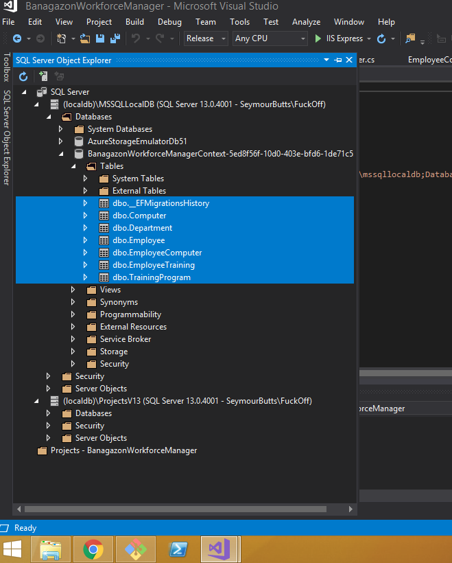
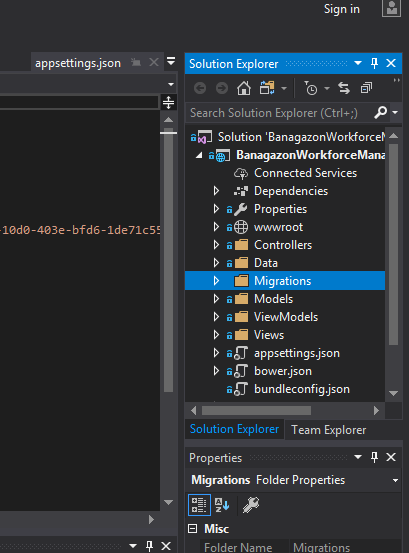
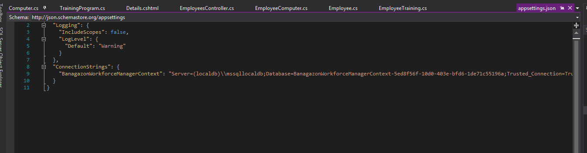

# MIGRATIONS EXAMPLE
This is a basic rundown of what Steve had us do in class to avoid merge issues with migrations folder moving forward. 

## STEP ONE - ONLY CHAZ DOES NEW MIGRATIONS
Essenstially it comes down to we only need one person on the team building migrations. We _should_ be in a pretty good spot now, but if anything comes up were you think we might need to adjust the models - let me know. Ill make a seperate branch, make the change, add the migration, and push it up into a new master for everyone to pull down. That will avoid all the merge conflicts with the migrations moving forward. 

## STEP TWO - MAKE SURE WERE ALL ON THE SAME PAGE. 
We'll need to adjust your current master branch to be on the same page as everything else. Heres a little overview on how to make that work. 
_Let me know if you have any changes youve worked on before you see this and we can figure out a way to push up a PR to avoid the merge issues_ 
Otherwise we'll get your new master setup and any new work you do will be branched off of the new master. 

1. Make sure you have [Git Bash](https://git-scm.com/download/win) installed so you can utilize a Git command line interface
1. Checkout into master in your directory in git bash. 
1. Delete your database as it is right now. 
  * In Visual Studio, Click `View` and select `SQL Server Object Explorer`
  * Naviate to the database by following the file tree as depicted in the images and delete the highlighted tables
  * 
1. In the Solution Explorer (the file tree on the right hand side that contains all the project files) Delete your migrations folder
  * 
1. Do a `git pull origin master` 
1. Make sure your environment path to the databse is correct. 
  * look at the appsettings.json file in the Solutions Explorer (it should be the file below the `Views` folder)
  

  1. HOPEFULLY WERE ALL GOOD

  To verify press `ctrl + fn + f5` and make sure it builds correctly. 
  Navigate to `localhost:portnumber/employees` and `localhost:portnumber/departments` and make sure all the info shows up. 

  Let me know if anything doesnt work right and we'll try and troubleshoot. 
